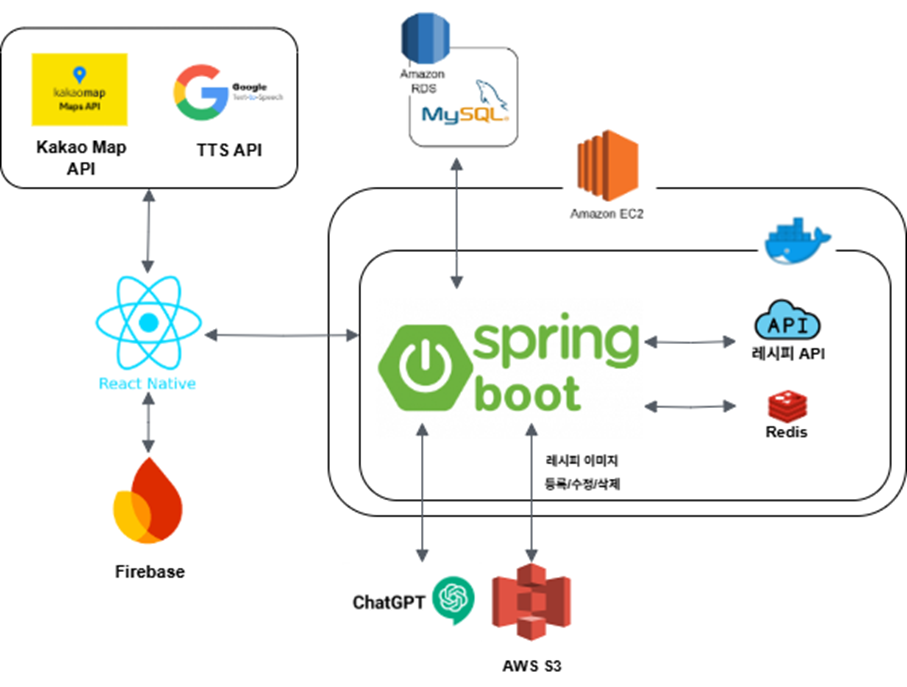
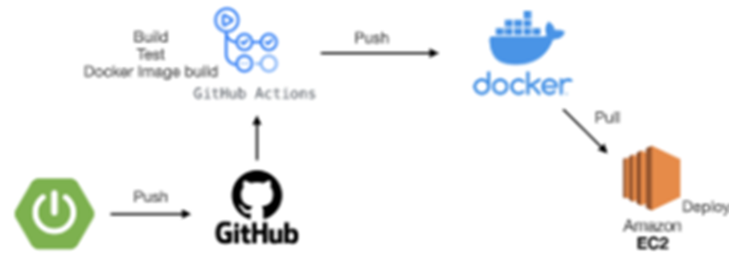
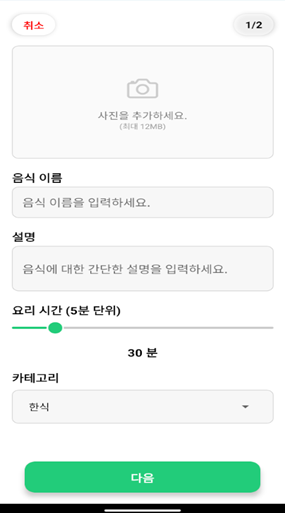
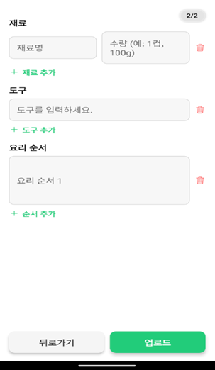
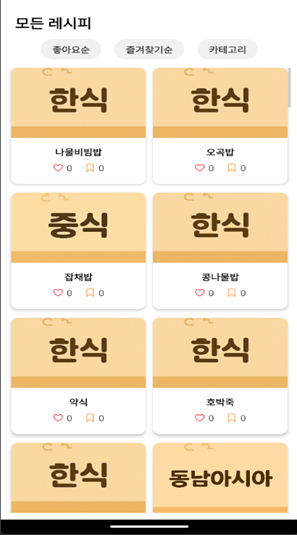
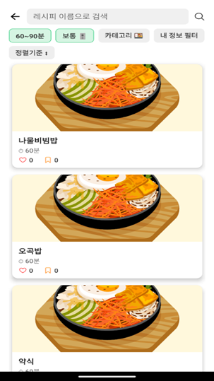
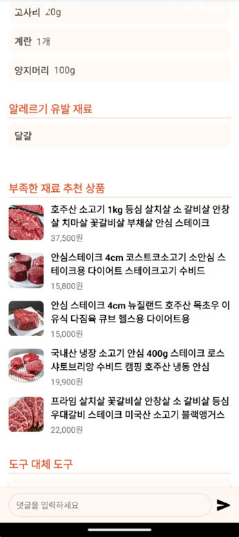
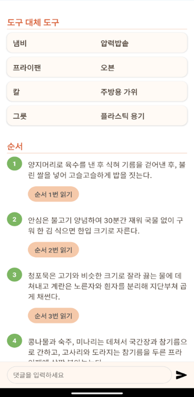
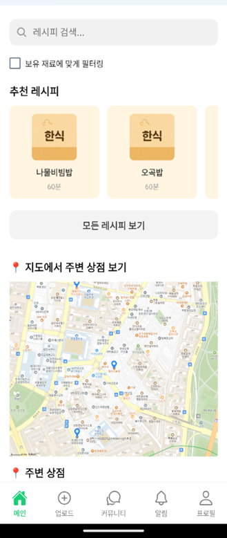
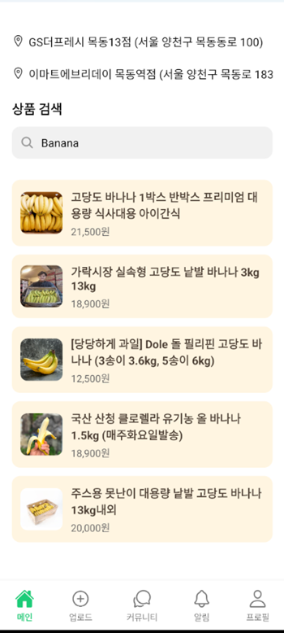

## 프로젝트 설명

**📝 프로젝트 이름**

---
- 개인 맞춤형 레시피 추천 서비스
- 개발 기간: 24.11 ~ 25.06

 

**🎯 사용 기술**

---
- **Java, SpringBoot, JPA, QueryDSL, MySQL, Redis, Spring Security+JWT+OAuth2, Docker, Github Actions, AWS EC2**
  
 

**🎯 주요 기능**

---
- 자카드 유사도를 통해 이전 검색기록 기반 레시피 추천 기능
- 사용자 정보(보유 재료, 보유 도구, 본인 알레르기)를 기반으로 맞춤형 레시피 추천 기능
- 네이버 검색 기반 API 기반 상품 추천 기능 (부족한 재료, 상품 검색 기반)
- Google TTS API 기반 TTS 기능 (요리 순서 설명)
- Google Maps API 기반 사용자 위치를 반영하여 주변 상점 추천 기능

 

**🚀 시스템 아키텍처**

---

 

## 📱 앱 구동 화면

---
**레시피 등록**

 

**레시피 추천 화면**

 

**레시피 정보 화면**

 

**홈 화면 (상품 검색 및 추천, 이전 검색 기록 바탕으로 레시피 추천, 주변 상점 탐색)**

 

## 👥 팀 소개

---

| 이름  | GitHub 주소                        | 역할             |
|-----|----------------------------------|----------------|
| 조영웅 | https://github.com/JoJimi        | 백엔드 개발, DevOps |
| 정한준 | https://github.com/kcjsend5      | 백엔드 개발         |
| 조용원 | https://github.com/yongwon992    | 프론트엔드 개발       |
| 장우진 | https://github.com/UjinChang9993 | 프론트엔드 개발       |

